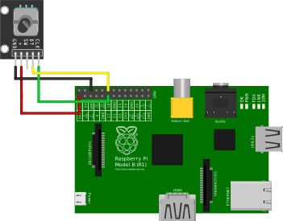

# inverted-pendulum-control

Progetto per la tesi di laurea di Giovanni Francesco Comune e Gianluca Pandolfi

## Requisiti

Il codice python per il Raspberry Pi necessita di pigpio. Installarlo con:
```
sudo apt-get install pigpio python-pigpio python3-pigpio
```
Avviare il demone di pigpio:
```
sudo systemctl enable pigpiod
sudo systemctl start pigpiod
```
## Schematica circuitale

