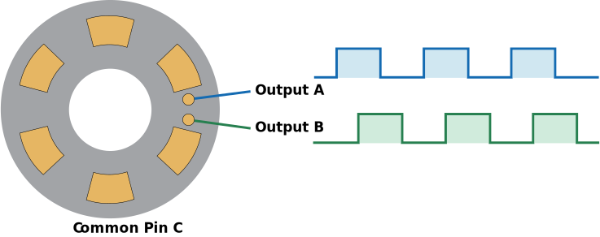
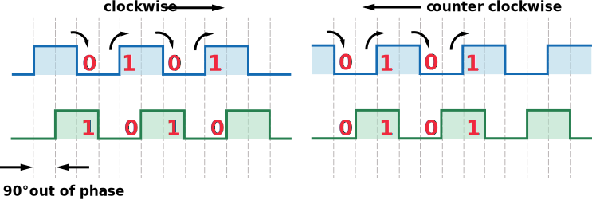

# inverted-pendulum-control

Progetto per la tesi di laurea di Giovanni Francesco Comune e Gianluca Pandolfi

## Requisiti

Il codice python per il Raspberry Pi necessita di pigpio. Installarlo con:
```
sudo apt-get install pigpio python-pigpio python3-pigpio
```
Avviare il demone di pigpio:
```
sudo systemctl enable pigpiod
sudo systemctl start pigpiod
```
## Schematica circuitale


## Misura angolare

L'encoder, quando ruota, trasmette delle onde quadre sui pin A e B. Analizzando i due segnali e il numero di fronti si può stabilire in che direzione sta ruotando.



Le onde quadre saranno sfasate. Nell'esempio, se l'onda quadra relativa al pin A è in anticipo allora l'encoder sta ruotando in senso antiorario, altrimenti in senso orario. Inoltre contando il numero di fronti di salita e discesa di entrambe le onde (le pulse) e conoscendo il numero di PPR (Pulse Per Revolution) si può calcolare la variazione angolare.

