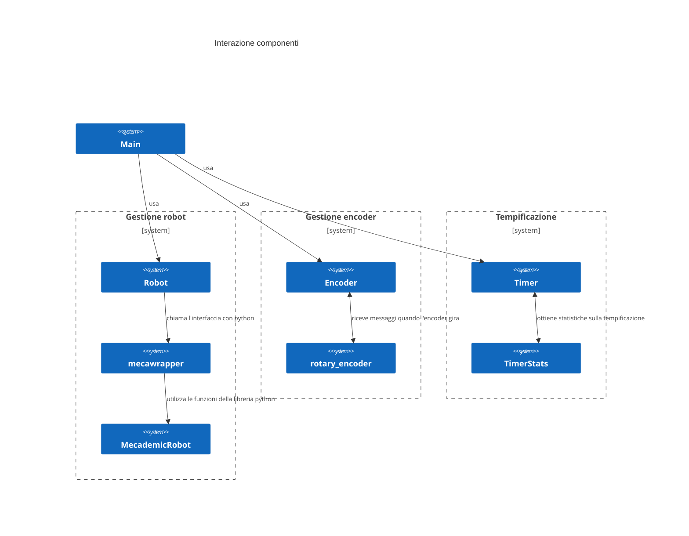
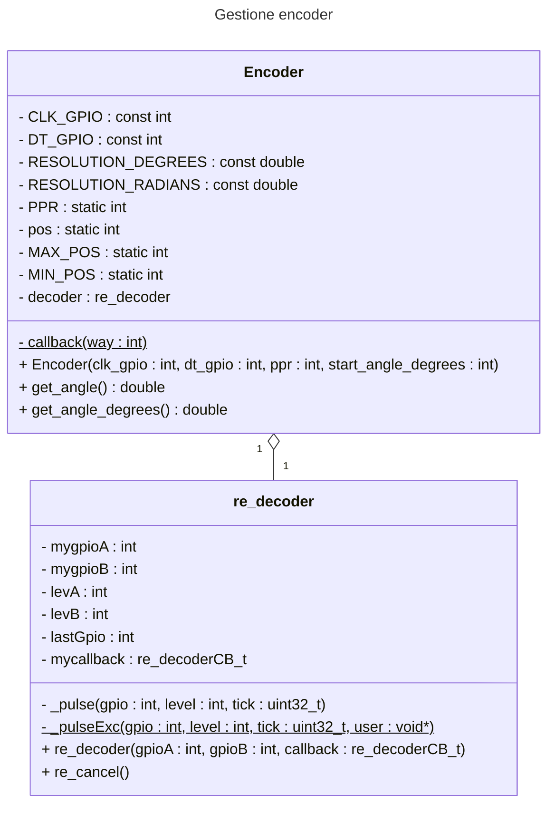
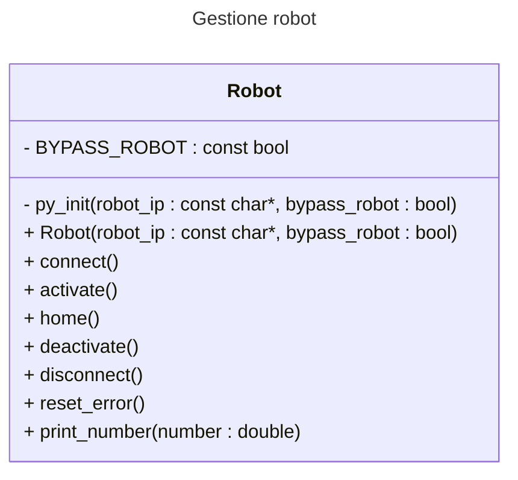
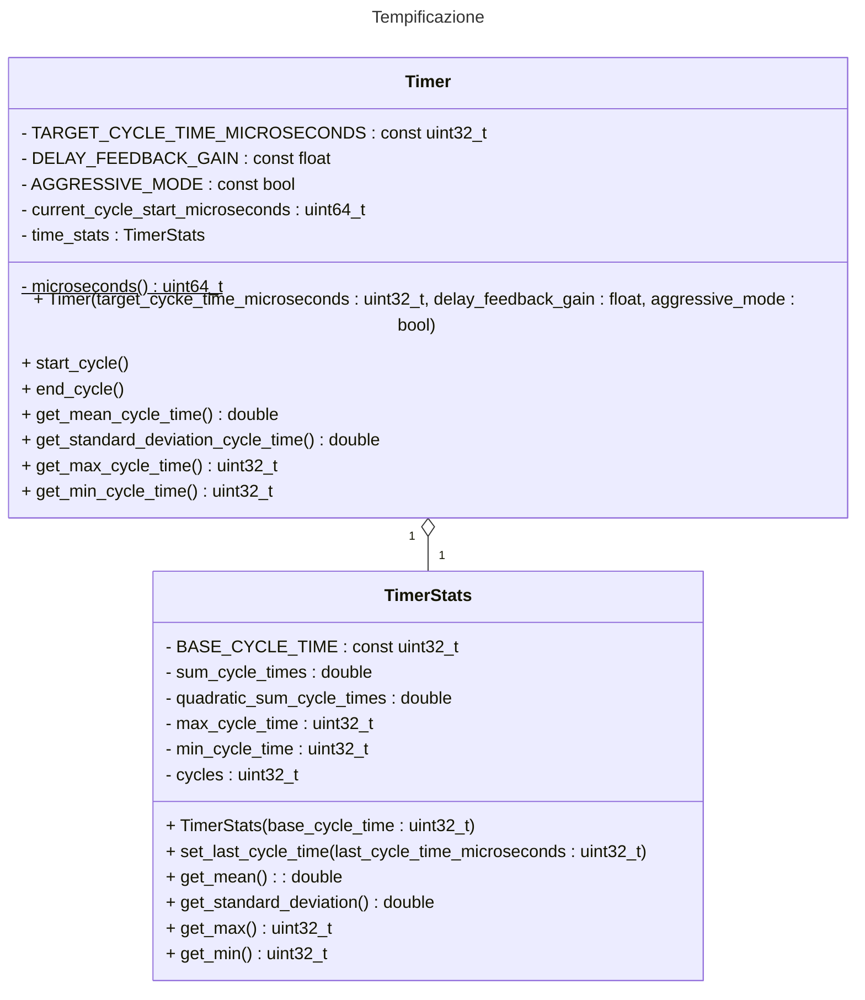

# Documentazione




# Gestione encoder

Il funzionamento dell'encoder è astratto dalla classe Encoder, che dipende dalla classe re_decoder.



La classe re_decoder si interfaccia direttamente con la libreria pigpio. Il suo costruttore richiede, oltre ai pin, 
un puntatore a una funzione callback che verrà richiamata quando l'encoder verrà girato. Nel nostro caso
sarà la funzione callback() della classe Encoder.
Quando l'encoder viene girato viene richiamato il metodo statico _pulseExc della classe re_decoder che
richiama a sua volta il metodo _pulse. Il metodo _pulse decide quale valore richiamare il callback
attraverso la seguente tabella.

| new clk | new dt | old clk | old dt | result      |
|:-------:|:------:|---------|--------|-------------|
| 0       | 0      | 0       | 0      | no movement |
| 0       | 0      | 0       | 1      | +1          |
| 0       | 0      | 1       | 0      | -1          |
| 0       | 0      | 1       | 1      | +2          |
| 0       | 1      | 0       | 0      | -1          |
| 0       | 1      | 0       | 1      | no movement |
| 0       | 1      | 1       | 0      | -2          |
| 0       | 1      | 1       | 1      | +1          |
| 1       | 0      | 0       | 0      | +1          |
| 1       | 0      | 0       | 1      | -2          |
| 1       | 0      | 1       | 0      | no movement |
| 1       | 0      | 1       | 1      | -1          |
| 1       | 1      | 0       | 0      | +2          |
| 1       | 1      | 0       | 1      | -1          |
| 1       | 1      | 1       | 0      | +1          |
| 1       | 1      | 1       | 1      | no movement |

Il metodo callback incrementa il campo pos di Encoder assicurandosi che
resti in (-PPR/2,PPR/2]

```
void Encoder::callback(int way) {
    Encoder::pos += way;
    if(Encoder::pos > Encoder::MAX_POS) {
        Encoder::pos -= Encoder::PPR;
    }
    else if(Encoder::pos <= Encoder::MIN_POS) {
        Encoder::pos += Encoder::PPR;
    }
}
```

# Gestione robot



# Tempificazione

